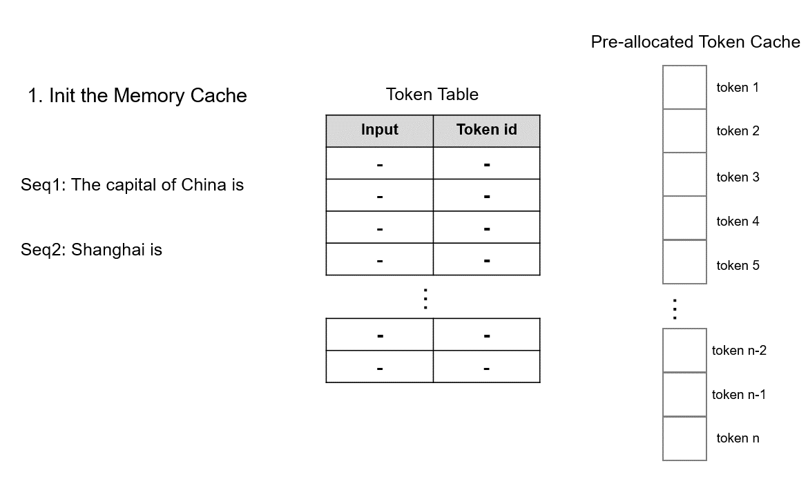

.. _lightllm:

LightLLM介绍
================

随着ChatGPT的流行，大语言模型(简称LLM)受到越来越多的关注。此类模式的出现，极大地提高了人们的工作效率。
然而，进一步广泛使用LLM的关键在于如何以低成本和高吞吐量地部署数十亿参数的模型。
为了提高大模型服务的吞吐量，让更多感兴趣的研究人员快速参与进来，
一种名为 LightLLM 的轻量级 LLM 推理服务框架应运而生。 
LightLLM 引入了一种更细粒度的kvCache管理算法，称为TokenAttention，
并设计了一个与TokenAttention高效配合的Efficient Router调度算法。
通过 TokenAttention 和 Efficient Router 的配合，
LightLLM 在大多数场景下实现了比 vLLM 和 Text Generation Inference 更高的吞吐量，
甚至在某些情况下性能提升了 4 倍左右。 LightLLM 灵活、用户友好且高效，
欢迎有兴趣的朋友进入 `项目主页 <https://github.com/ModelTC/lightllm>`_ 了解更多。

.. _challenge:

LLM 推理服务的挑战
------------------

大型语言模型由于其优异的性能而引起了研究人员的极大关注。
这些模型不仅可以与人类进行日常对话，还可以帮助完成各种日常任务，从而提高生产力。
然而，尽管这些模型表现出了出色的性能，但提高部署大规模模型的性能仍面临以下挑战：

* **内存碎片严重**：从几十到几百G不等的网络权重，以及推理过程中不断动态增长的KV Cache，容易导致大量的内存碎片，进而导致内存利用率低。
* **请求调度效率低**：请求的长度随时间动态变化，可能导致GPU空闲或利用率低的问题。
* **内核定制难度大**：为了高效利用内存、提高服务吞吐量，需要针对网络定制内核。然而，这需要研究人员付出大量的努力。

.. _solutions_and_problems:

现有的解决方案和存在问题
-----------------------------

为了应对上述挑战，许多优秀的LLM推理框架应运而生，
例如FasterTransformer、Text-Generation-Inference（简称TGI）、vLLM等。这些框架的核心特性和能力如下表所示：

.. list-table:: 各个框架对比
   :header-rows: 1

   * - 框架
     - NV Triton + FasterTransformer
     - TGI
     - vLLM
     - LightLLM
   * - 核心特征
     - 高效算子
     - `Continuous batch <https://github.com/huggingface/text-generation-inference/tree/main/router>`_, Token streaming
     - `PageAttention <https://vllm.ai/>`_
     - 三进程异步协同, `Token Attention <https://github.com/ModelTC/lightllm/blob/main/docs/TokenAttention.md>`_, Efficient Router
   * - 内存碎片
     - 少
     - 多
     - 少
     - 少
   * - 请求的调度效率
     - 低
     - 中
     - 中
     - 高
   * - 定制化算子的难度
     - 高
     - 中
     - 中
     - 低

这些框架都有自己独特的特点。
例如，FasterTransformer具有优异的静态推理性能，但缺乏健壮的服务调度，并且主要采用C++开发，导致二次开发成本较高。 
TGI具有优秀的服务接口和Continuation Batch等调度特性，但其推理性能、调度策略、内存管理等方面存在一些不足。 
vLLM具有出色的内存管理能力，但在请求调度方面缺乏效率，其整体实现细节更适合部署小型模型。

Lightllm
----------------------

因此，为了解决这些问题，我们开发了一个名为LightLLM的LLM部署框架，它是基于纯Python语言的。
它使研究人员能够在本地轻松部署和定制轻量级模型，从而可以快速扩展不同模型并集成各种优秀的开源功能。 
LightLLM的核心特点如下：

* 三进程异步协作：分词、模型推理、去分词异步进行，GPU利用率大幅提升。
* Token Attention：实现token-wise的KV缓存内存管理机制，实现推理时内存零浪费。
* Efficient Router：与Token Attention合作，精心管理每个Token的GPU内存，从而优化系统吞吐量。

凭借基于OpenAI Triton开发的高度协调的高效内核和服务调度，LightLLM实现了优异的吞吐性能。

Token Attention
-------------------

Transformer 构成了现代大型语言模型的基础。
在自回归解码期间，这些模型将上下文标记的KV张量缓存到 GPU 内存中，以便于快速生成下一个Token。
然而，这些缓存占用了大量的 GPU 内存。
并且由于每个请求长度的可变性，缓存大小的不可预测性加剧了该问题，在缺乏合适的内存管理机制的情况下这会导致严重的内存碎片。

因此，我们引入了TokenAttention，这是一种可以在Token细粒度下管理KV缓存的注意力机制，并实现高性能内核、高效的内存分配和释放操作。 
TokenAttention的运行机制如下图所示：

1. 模型初始化时，系统根据用户设置的 ``max_total_token_num`` 预先申请 KV 缓存显存，并创建 Token Table 来记录输入 token 的实际存储位置。
2. 当处理新请求时，系统首先检查预分配的Token缓存中是否有可用的连续空间用于存储KV Cache。 TokenAttention 倾向于为请求分配连续的内存，以最大限度地减少推理过程中的内存访问。仅当连续空间不足时，才会为请求分配非连续的内存。分配的空间记录在Token Table中，用于后续的注意力计算。
3. 对于新生成的Token的缓存，只需从预先分配的Token缓存中找到未使用的空间并将相应的条目添加到Token表中即可。此外，为了有效地分配和释放Cache，我们利用Torch Tensor在GPU上的并行计算能力来管理预分配Token Cache的状态。首先，我们定义状态如下:

    .. code-block:: python

        self.mem_state = torch.ones((size,), dtype=torch.bool, device="cuda")
        self._mem_cum_sum = torch.empty((size,), dtype=torch.int32, device="cuda")
        self.indexes = torch.arange(0, size, dtype=torch.long, device="cuda")
        self.can_use_mem_size = size

    ``mem_state`` 记录了缓存的使用状态，其中1代表未使用，0代表已使用。 ``_mem_cum_sum`` 用于 ``mem_state`` 的累积和，用于有效地识别和选择未使用的空间进行缓存分配。分配过程如下：

    .. code-block:: python

        torch.cumsum(self.mem_state, dim=0, dtype=torch.int32, out=self._mem_cum_sum)
        # 
        select_index = torch.logical_and(self._mem_cum_sum <= need_size, self.mem_state == 1)
        select_index = self.indexes[select_index]
        self.mem_state[select_index] = 0
        self.can_use_mem_size -= len(select_index)

    可以观察到，我们的缓存状态管理全部在GPU上完成，充分利用了torch的并行能力，从而让系统能够高效地为每个请求分配缓存空间。

4. 请求完成后，可以通过删除 ``Token Table`` 上的记录来快速释放相应的显存，从而为调度新的请求让路。

    .. code-block:: python

        self.can_use_mem_size += free_index.shape[0]
        self.mem_state[free_index] = 1

5. 由于Token级别的 GPU 内存管理，TokenAttention 可以实现 GPU 内存的零浪费。它可以准确地计算出系统可以容纳多少新Token进行计算。因此，当结合 ``Efficient Router`` 来管理请求时，它可以在推理过程中不断添加新的请求，充分利用每一块GPU内存，最大化GPU利用率。

Efficient Router
-----------------

引入高效路由器来管理传入请求，并动态确定该请求是否可以与已运行的推理批次融合。
合并标准是估计合并推理过程中最大Token占用量是否小于硬件可容纳的最大容量。
这里，我们将这个最大容量设置为 ``max_total_token_num``。在 **Token Attention** 的支持下，我们可以准确地管理Token的使用情况，并且可以确保永远不会出现内存不足（out-of-memory）的情况。

如上图所示，每一行代表一个请求当前的运行状态，黄色代表已经运行过的历史kv缓存token，每个格子代表一个token，灰色代表要生成的token。
生成的Token数量由每个请求设置的最大输出长度和已生成的Token数量决定。
上图中，绿色网格的第二行表示新到达的请求，图中按照要生成的输出的长度升序列出了所有请求。

如果我们假设新的请求融合成一个Batch进行推理，那么最大的token使用量必然会出现在时间点1、时间2、时间3中的一个时间点，我们只需要计算这些时间点的token使用量是否达到最大值即可。三个时间点都没有超过max_total_token_num，说明新的请求可以加入到Batch中进行融合推理。

时间1的总使用代币等于黄色单元格数量加上绿色单元格数量（见下图）

时间2的总使用代币等于黄色方块的数量加上绿色方块的数量（见下图）

时间3的总使用代币等于黄色方块的数量（见下图）

实际最大令牌使用量始终为时间 1、时间 2 或时间 3 之一。

只要动态推理过程中token的最大使用量低于max_total_token_num，就说明可以批量进行新的请求进行推理。

为了快速计算批次中所有请求所需的最大令牌使用量，我们使用 numpy 实现了一个高效的示例。

.. code-block:: python

    import numpy as np

    def demo():
        max_total_token_num = 100
        req_list = [(5, 4), (4, 3), (5, 3), (3, 2), (4, 2)]  # (run_len, left_output_len)
        req_list.sort(key=lambda x: -x[1])

        left_out_len_array = np.array([e[1] for e in req_list])
        has_run_len_array = np.array([e[0] for e in req_list])
        cum_run_len_array = np.cumsum(has_run_len_array)
        size_array = np.arange(1, len(req_list) + 1, 1)
        need_max_token_num = (left_out_len_array * size_array + cum_run_len_array).max()

        if need_max_token_num <= max_total_token_num:
            print("ok")
        else:
            print("oom")

性能评测
-----------

我们使用当前主流推理框架TGI、NV Triton + FasterTransformer、vLLM在ShareGPT_Vicuna_unfiltered数据集上进行了性能比较。结果如下图所示。可以看出，LightLLM 在不同模型大小上实现了更高的吞吐量。 TGI内存碎片严重，难以实现高吞吐量。 vLLM引入了PageAttention，但由于其整体实现细节更利于小模型推理，因此在大模型上的并发性能不是很理想（使用默认配置）。相比之下，LightLLM 在各种模型尺寸上都保持了稳健的性能，并且在大型模型 (LLaMA-65B) 上比 TGI 和 vLLM 提高了约 2-3 倍。

TGI兼容性和消融分析为了进一步验证TokenAttention和Router的有效性，我们还将这些功能集成到TGI中以解决其内存碎片问题，如下图（左）所示。可以看出，引入TokenAttention和Router后，与原始TGI相比，性能提升了4倍以上。

长短混合请求情况下的改进：从下图（左）可以看出，Router的引入并没有带来更明显的性能提升，这是由于问题长度的差异ShareGPT_Vicuna_unfiltered 的数据集并不重要。为此，我们构建了长度差异较大的请求集合，并验证了高效路由器的性能。结果如下所示（右）。可以看到，我们的Efficient Router可以更好地利用GPU资源，对于问题长度差异较大的请求可以带来近50%的性能提升。

左图展示了LightLLM和TGI的兼容性以及消融分析，右图展示了我们的Efficient Router对长短请求的增强

未来工作
---------

* 支持更多的模型
* 增强路由调度算法
* 高性能的 int8 和 int4 仅权重的 kv cache 的支持
* 全量化模型的支持
* 混合精度模型
* 稀疏化

LightLLM致力于让更多人参与进来，从而灵活高效地探索各种LLM部署和推理解决方案。也为硬件厂商推动该领域的发展提供参考。我们希望大家能够给它更多的star，fork这个项目，并做出贡献。我们相信未来将会出现更多的技术和解决方案（如TensorRT），不断降低部署成本，让AGI更容易走进普通家庭。
