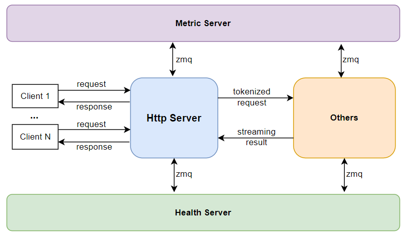
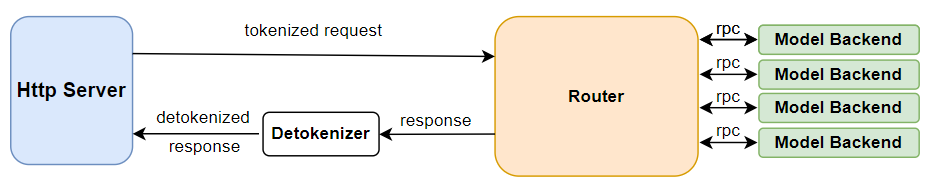

lightllm概述
==========================

lightllm 的设计核心是多进程协作，每个进程负责一个模块，通过zmq和rpc的方式进行多进程协同工作。
lightllm中包括以下的模块：

* **Http Server** ： 负责接收请求
* **Metric Server** ：负责记录系统运行的性能指标
* **Health Server** ：负责监控系统运行的健康情况
* **Router** : 负责调度请求
* **Visual Server** : 负责处理多模态请求
* **Cache Manager Server** ：负责管理多模态信息的推理结果的缓存
* **Model Backend** ：负责管理单个设备的模型推理，可以有若干个

下面我们将逐一讲解重要的模块。

Http Server
-----------------------

当我们重点关注Http Server时，可以看到其在lightllm系统的作用如上图所示，运行时它主要负责：

* 接收API请求
* **对于系统查询请求**，跟 ``Metric Server`` 和 ``Health Server`` 协作获取相关信息
* **针对于纯文本请求**，将文本 tokenized，包装成纯文本请求发送给 ``Router``
* **针对于多模态请求**，获取图片数据的md5码，使用md5码跟 ``Cache Manager Server`` 申请缓存，并将图片数据存到缓存上，将文本 tokenized，和多模态信息一起包装成多模态请求发送给 ``Visual Server``

Router
----------------

Router主要负责 **调度**，它不断地接收 request，并从中选择合适的requests送到 ``Model Backend`` 。
具体的调度算法，请阅读：:ref:`Efficient_Router`

Visual Server 和 Cache Manager Server
----------------------------------------

