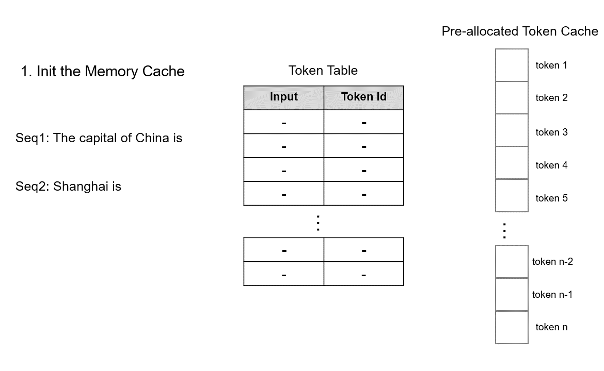

TokenAttention
=======================

Transformer 构成了现代大型语言模型的基础。在自回归解码期间，这些模型将上下文标记的键值张量缓存到 GPU 内存中，以便于快速生成下一个标记。然而，这些缓存占用了大量的 GPU 内存。由于每个请求长度的可变性，缓存大小的不可预测性加剧了该问题，在缺乏合适的内存管理机制的情况下导致严重的内存碎片。

为了缓解这个问题，PagedAttention被提出将KV缓存存储在非连续的内存空间中。它将每个序列的 KV 缓存划分为多个块，每个块包含固定数量令牌的键和值。这种方法有效地控制了注意力计算期间最后一个块内的内存浪费。虽然PagedAttention在一定程度上缓解了内存碎片，但仍然留下了内存浪费的空间。此外，在处理多个高并发请求时，内存块的分配和释放效率较低，导致内存利用率不高。

为了解决上述挑战，我们引入了 TokenAttention，这是一种在令牌级别管理键和值缓存的注意力机制。与 PagedAttention 相比，我们的 TokenAttention 不仅可以最大限度地减少内存碎片并实现高效的内存共享，而且还可以促进高效的内存分配和释放。它允许更精确和细粒度的内存管理，从而优化内存利用率。

.. list-table:: 特性比较
   :widths: 30 15 15
   :header-rows: 1

   * - Features
     - PagedAttention
     - TokenAttention
   * - 低内存碎片
     - ✓
     - ✓
   * - 高效内存共享
     - ✓
     - ✓
   * - 高效内存申请和释放
     - ✗
     - ✓
   * - 精细内存管理
     - ✗
     - ✓

TokenAttention的运行机制如下图所示：

模型初始化时，根据用户设置的 **max_total_token_num** 预先分配 KV 缓存，并创建 Token Table 来记录输入 token 的实际存储位置。

当处理新请求时，系统首先检查预分配的Token缓存中是否有可用的连续空间用于存储键值（KV）缓存。 TokenAttention 倾向于为请求分配连续的图形内存空间，以最大限度地减少推理过程中的内存访问。仅当连续空间不足时，才会为请求分配非连续显存。由于内存管理是逐个令牌进行的，因此 TokenAttention 几乎实现了零浪费，与 vllm 相比，产生了更高的吞吐量。

我们使用 OpenAI Triton 实现了一个高效的 TokenAttention 运算符。当提供查询向量时，该算子可以根据Token Table高效地检索相应的KV缓存并进行注意力计算。

请求完成后，可以通过删除令牌表上的记录来快速释放相应的显存，从而为调度新的请求让路。由于 TokenAttention 在模型初始化时预先分配了所有 KV 缓存空间，因此可以为已完成的请求高效释放内存，并在动态调度时合并不同批次的请求，从而有效最大化 GPU 利用率。